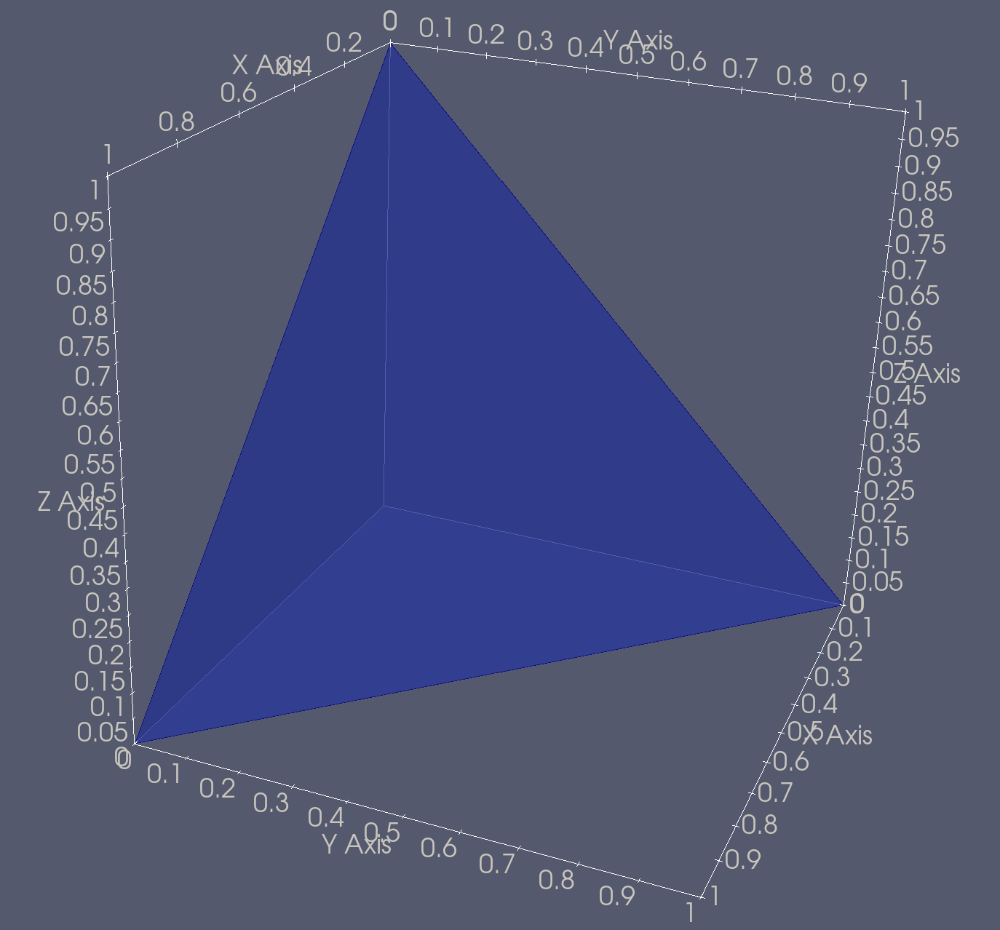
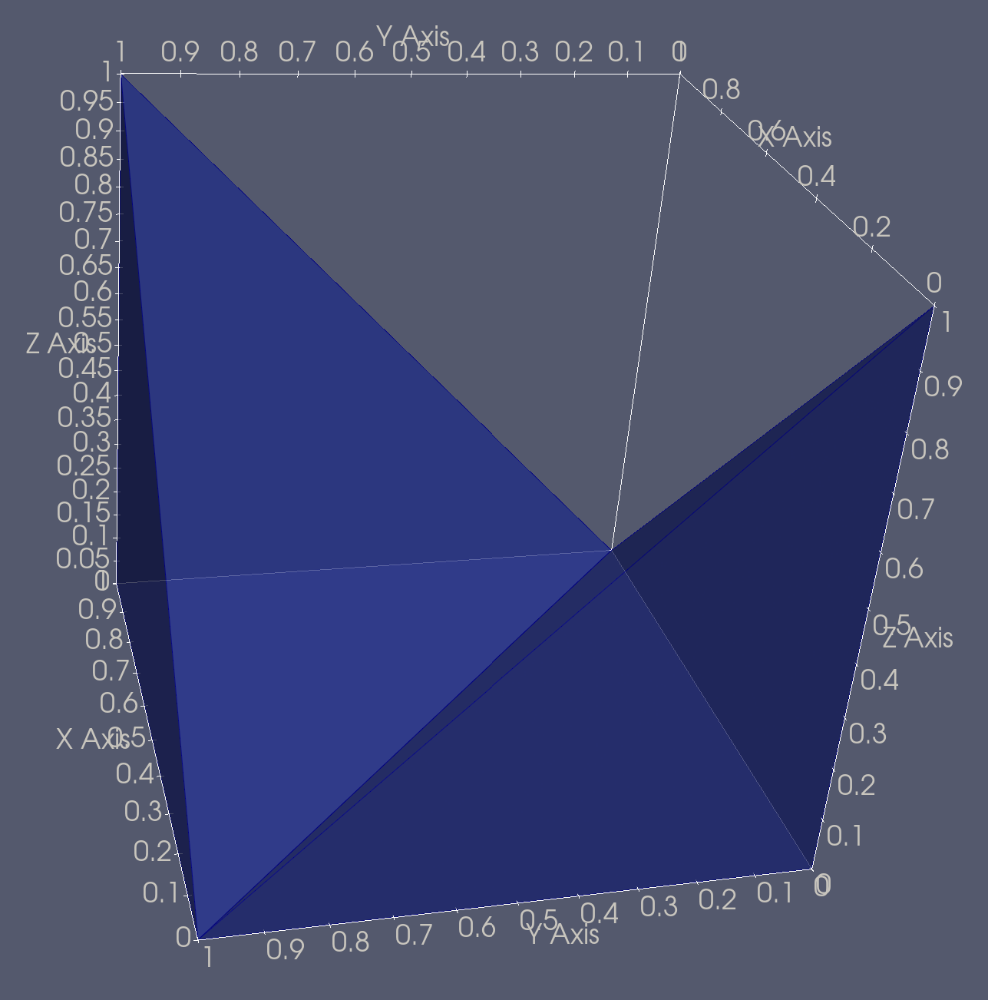

[](https://www.python.org)

[](https://github.com/fusion-energy/vertices_to_h5m/actions/workflows/ci_with_install.yml)

[](https://github.com/fusion-energy/vertices_to_h5m/actions/workflows/python-publish.yml)
[](https://github.com/fusion-energy/vertices_to_h5m/actions/workflows/anaconda-publish.yml)

[](https://anaconda.org/fusion-energy/vertices_to_h5m)
[](https://pypi.org/project/vertices_to_h5m/)

This is a minimal Python package that provides a Python API interfaces for converting mesh vertices into a DAGMC h5m file ready for use in simulation.

Convert a set of vertices with their connectivity in to a DAGMC h5m file complete with material tags and ready for use neutronics simulations.

**warning** this approach does not imprint and merge the geometry and therefore
requires that the mesh is well formed and does not overlap. Overlaps could lead
to particles being lost during transport. If imprinting and merging is required
consider using [Paramak export_dagmc_h5m()](https://paramak.readthedocs.io/en/main/)
method or [cad-to-h5m](https://github.com/fusion-energy/cad_to_h5m) to make the
DAGMC geometry.

It is strongly advised to used the DAGMC overlap checker to check the
resulting h5m file (see checking for overlaps section below).


# Installation - Conda

This single line command should install the package and dependencies (including moab)

```bash
conda install -c fusion-energy -c fusion-energy vertices_to_h5m
```

# Installation - Pip + Conda

These two commands should install the package and dependencies. Moab requires a separate install as it is not available on ```pip```

```bash
conda install -c conda-forge moab
pip install vertices_to_h5m
```

# Examples

These examples with volumes made from just four triangles to keep the examples minimal.
The package can also convert larger meshes as shown in the picture below.
## Usage - single volume

To convert a single volume mesh into a h5m file. This also tags the volume with the
material tag mat1.

```python
from vertices_to_h5m import vertices_to_h5m

# these are the x,y,z coordinates of each vertex. Entries should be floats 
vertices = np.array([
    [0., 0., 0.],
    [1., 0., 0].,
    [0., 1., 0.],
    [0., 0., 1.]
])

# These are the triangle that connect individual vertices together to form a continious surface and also a closed volume. Entries should be ints
triangles = np.array([
    [0, 1, 2],
    [3, 1, 2],
    [0, 2, 3],
    [0, 1, 3]
])

# This will produce a h5m file called one_volume.h5m ready for use with DAGMC enabled codes.
vertices_to_h5m(
    vertices=vertices,
    triangles=triangles,
    material_tags=["mat1", "mat2"],
    h5m_filename="one_volume.h5m",
)
```



## Usage - multiple volumes

To convert multiple mesh volumes files into a h5m file. This also tags the relevant volumes with material tags called mat1 and mat2. This example also uses numpy arrays instead of lists, both are acceptable.

```python
from vertices_to_h5m import vertices_to_h5m
import numpy as np

# These are the x,y,z coordinates of each vertex. Numpy array is set to type float to enforce floats
vertices = np.array(
    [
        [0, 0, 0],
        [1, 0, 0],
        [0, 1, 0],
        [0, 0, 1],
        [1, 1, 1],
        [1, 1, 0]
    ], dtype="float64"
)

# These are the two sets triangle that connect individual vertices together to form a continious surfaces and also two closed volume.
triangles = [
    np.array([[0, 1, 2], [3, 1, 2], [0, 2, 3], [0, 1, 3]]),
    np.array([[4, 5, 1], [4, 5, 2], [4, 1, 2], [5, 1, 2]]),
]

# This will produce a h5m file called two_volume_touching_edge.h5m ready for use with DAGMC enabled codes
vertices_to_h5m(
    vertices=vertices,
    triangles=triangles,
    material_tags=["mat1", "mat2"],
    h5m_filename="two_volume_touching_edge.h5m",
)

```



# Checking for overlaps

To check for overlaps in the resulting h5m file one can use the DAGMC
overlap checker. -p is the number of points to check on each line

```bash
conda install -c conda-forge
overlap_check dagmc.h5m -p 1000
```
